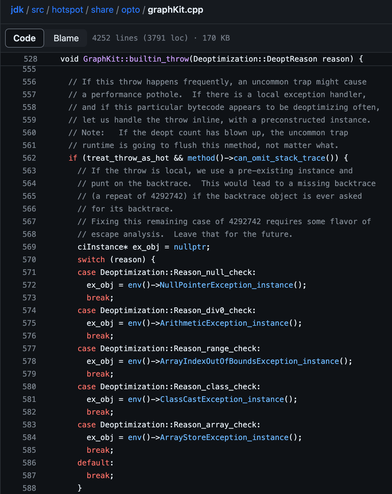

## 문제 상황

테스트 스크립트를 배포시에 실행하게 되어 있는데, 해당 스클립트는 같은 api를 여러 case로 몇십번 호출한다.

최초 실행시에는 성공하고,

두번째 이후부턴 실패한다.

<!-- truncate -->

지금까지는 서비스 실행시 한번만 실행했어서 발견을 못 한 문제였다.

에러가 발생한 지점은 여기였다.

```java
catch (Exception e) {
    String msg = e.getMessage(); // errMsg: null
    if (msg.equalsIgnoreCase("XXX")) { // NullPointerException 발생!
        //
    }
}
```

try ~ catch 문에서 에러 메세지를 가져와 어떤 에러 메시지인지 판단하려고 할 때, `e.getMessage()` 결과가 **null** 이 되어 catch 구문에서 다시 에러가 발생하는 것이였다.

로직을 살펴보니 특정 case엔 무조건 try쪽에서 NPE가 발생하고, catch문으로 들어오게 되어있었다.

근데 왜 최초 실행시엔 msg가 null이 아닌가..???!!!

해당 현상을 재현한 뒤에 최초 실행 / 이후 실행에 대한 에러를 출력해 보았다.

**최초**

```
class java.lang.NullPointerException: Cannot invoke "Object.toString()" because of "java.util.Map.get(Object) is null
// 굉장히 긴 StackTrace
```

**두번째~**

```java
class java.lang.NullPointerException: null
```

나는 내가 로직 어딘가에 NPE가 발생하는 원인을 놓친줄 알고 며칠을 삽질했는데, 스택오버플로우에서 이 글을 발견했다.

> https://stackoverflow.com/questions/2411487/nullpointerexception-in-java-with-no-stacktrace

관련해서 간략하게 조사해 보았다.

## JVM Stacktrace 생략

[JDK5 릴리즈 노트](https://www.oracle.com/java/technologies/javase/release-notes-introduction.html)를 보면 Exception이 반복적으로 발생할 때, 컴파일러는 StackTrace를 출력하는것을 멈춘다고 한다.

이것은 JVM의 JIT컴파일러의 C2컴파일러의 기본 최적화 옵션 이라고 한다.

[OpenJDK의 소스 코드](https://github.com/openjdk/jdk/blob/master/src/hotspot/share/opto/graphKit.cpp#L528)를 보면 다음 다섯가지 Exception에 대해 최적화 옵션이 적용된다.

:::info

**Stacktrace 생략 최적화 옵션 적용되는 Exception**

- NullPointerException
- ArithmeticException
- ArrayIndexOutOfBoundsException
- ClassCastException
- ArrayStoreException

:::



최적화 옵션을 비활성화 하려면 아래 JVM 옵션을 추가해 주면 된다.

```
-XX:-OmitStackTraceInFastThrow
```

하지만 이는 성능 최적화를 위한 옵션으로, 해당 Exception이 반복적으로 일어나지 않게끔 처리 하는것이 올바른 방향 일 것이다.

Exception 처리에 대한 최적화를 하는 이유가 궁금해서 찾아보았다.

Java에서 Exception을 던지는 비용은 꽤 비싸다고 한다. Exception이 발생하면 해당 예외가 어디서 발생했는지 추적하며 정보를 수집하고 Stack Trace를 생성한다. 이를 계산하는데에도 시간이 꽤 걸린.

또, 예외 객체를 새로 생성하고 초기화 하는 과정이 반복되기 때문에 좋지 않다. 그리고 Exception이 발생하면 그것이 어떤 예외인지 적절한 예외 핸들러를 찾아 리턴해줘야 하는데, 예외 핸들러를 찾는 과정 또한 오래 걸린다.

프로젝트를 할 때도, 적절한 예외 상황에 Custom Exception을 던지곤 했는데, 이게 맞는 방법인지 생각해볼 필요가 있는 듯 하다.

그리고 스택 추적이 필요하지 않은 경우라면 override를 통해 trace를 담지 않도록 하는 방법도 좋겠다.
