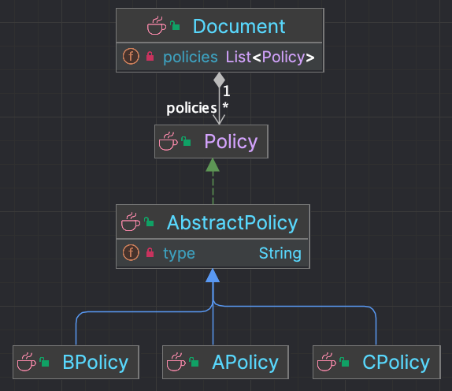

다양한 json 구조를 다형성을 적용한 (인터페이스, 상속 ...) 자바 객체로 역직렬화 하기!

<!-- truncate -->

## 클래스 구조

opensearch(≒elasticsearch) 인덱스 매핑이 dynamic으로 되어 있고, type별로 json 구조가 달랐습니다. 기존 코드는 HashMap으로 읽은 다음 `.get().get()...` 하는 구조로 되어 있었습니다🥲.

해결법이 있을 거라 굳게 믿고, draw.io를 켜 야심차게 인터페이스와 추상클래스로 아래 구조로 추상화를 해보았습니다. (회사 코드를 가져올 수 없어 클래스 이름은 임의로 정했습니다.)



`opensearch-java` 라이브러리를 사용해서 다음과 같이 response를 지정한 클래스로 역직렬화 할 수 있습니다.

```java
SearchResponse<IndexData> searchResponse = client.search(s -> s.index(index), IndexData.class);
```

opensearch-java는 내부적으로 **jackson** 라이브러리를 사용하고 있습니다.

해결법은 의외로 간단했는데요, Jackson에서 제공하는 어노테이션으로 서브 타입을 매핑하면 됩니다.

## 매핑 타입을 지정하지 않았을 때

일단 아무런 조치를 하지 않았을 때, 어떤 일이 일어나는지 살펴봅시다. 아래와 같은 json을 Document.class로 역직렬화 해보겠습니다.

```json
{
  "policies": [
    {
      "type": "a"
    },
    {
      "type": "b"
    },
    {
      "type": "c"
    }
  ]
}
```

```java
ObjectMapper objectMapper = new ObjectMapper();
String json = "{\"policies\":[{\"type\":\"a\"},{\"type\":\"b\"},{\"type\":\"c\"}]}";
Document document = objectMapper.readValue(json, Document.class);
```

```java
com.fasterxml.jackson.databind.exc.InvalidDefinitionException: Cannot construct instance of `hello.jsontest.classes.Policy` (no Creators, like default constructor, exist): abstract types either need to be mapped to concrete types, have custom deserializer, or contain additional type information
```

`InvalidDefinitionException` 이 터집니다. 정확한 타입을 지정해주거나 추가 정보를 제공해주라고 하네요.

Jackson이 제공하는 어노테이션으로 타입을 지정하는 방법을 알아봅시다.

## @JsonTypeInfo과 @JsonSubTypes

`@JsonTypeInfo`는 서브 타입을 어떤 정보를 사용해 지정할 것인지 정해주는 어노테이션,<br/>
`@JsonSubTypes`는 실제 서브타입을 어떤 클래스로 지정할 것인지 정해주는 어노테이션 입니다.

위 클래스 구조에서, Policy 클래스에 매핑 정보를 정의하려면 이렇게 할 수 있습니다.

```java
@JsonTypeInfo(use = Id.NAME, include = As.EXISTING_PROPERTY, property = "type")
@JsonSubTypes({
        @JsonSubTypes.Type(value = APolicy.class, name = "a"),
        @JsonSubTypes.Type(value = BPolicy.class, name = "b"),
        @JsonSubTypes.Type(value = CPolicy.class, name = "c")
})
public interface Policy {
}
```

```java
ObjectMapper objectMapper = new ObjectMapper();
String json = "{\"policies\":[{\"type\":\"a\"},{\"type\":\"b\"},{\"type\":\"c\"}]}";
Document document = objectMapper.readValue(json, Document.class);
System.out.println("document.getPolicies().get(0).getClass() = " + document.getPolicies().get(0).getClass());
System.out.println("document.getPolicies().get(1).getClass() = " + document.getPolicies().get(1).getClass());
System.out.println("document.getPolicies().get(2).getClass() = " + document.getPolicies().get(2).getClass());
```

위 코드를 실행하면 다음과 같은 결과를 얻을 수 있습니다.

```java
document.getPolicies().get(0).getClass() = class hello.jsontest.classes.APolicy
document.getPolicies().get(1).getClass() = class hello.jsontest.classes.BPolicy
document.getPolicies().get(2).getClass() = class hello.jsontest.classes.CPolicy
```

의도된 대로 역직렬화가 잘 된것을 볼 수 있습니다. 👍

위에 적용된 옵션에 대한 설명입니다.

- **@JsonTypeInfo**
  - name이라는 특정 property를 지정해 타입 구분
  - 이미 존재하는 "type"이라는 필드로 타입을 구분합니다.
- **@JsonSubTypes**
  - "a"라는 name은 APolicy.class에, "b"라는 name은 BPolicy.class에
  - 와 같은 구현 정보를 매핑해줍니다.

따라서 Jackson은 "type"필드 값이 a라면 APolicy, b라면 BPolicy를 매핑할 수 있게 된 것입니다.

`use`에는 세 옵션을 사용할 수 있습니다.

- **Id.CLASS**: 클래스 명으로 서브타입을 구분하겠다는 의미입니다.
  - 직렬화시 class 명이 json에 남게 됩니다.
- **Id.NAME**: 위 예시처럼, 특정 프로퍼티를 name으로 지정해 구분합니다.
  - include = As.PROPERTY
    - 직렬화 시 type 정보가 생성됩니다.
  - include = As.EXISTING_PROPERTY
    - 직렬화 시 기존 필드를 사용합니다. (새로운 필드가 생성되지 않습니다)
- **Id.DEDUCTION**: 각각의 서브 타입에서 구분할만한 필드가 있다면, jackson에서 추론해 변환해주는 설정입니다.

각각의 상황에 맞게 적용해 주면 되겠습니다 :)

## 마치며

기존의 HashMap을 이용한 코드에서, 자바답게 다형성을 유지하며 역직렬화를 할 수 있게 되어서, 더욱 깔끔하고 유연한 코드를 작성할 수 있게 되었습니다. 역시 안되는 것은 없네요..😚
